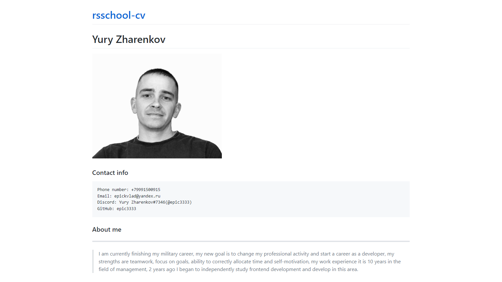

# Yury Zharenkov 


### Contact info

    Phone number: +79991500915
    Email: epickvlad@yandex.ru
    Discord: Yury Zharenkov#7346(@epic3333)
    GitHub: epic3333

### About me
***
>I am currently finishing my military career. My new goal is to change my professional activity and to start a career as a developer. My strengths are teamwork, focus on goals, ability to allocate time correctly as well as self-motivation. My work experience is 10 years in the management sphere. 2 years ago I began studying front-end web development and continue to improve my skills in this sphere.

### Skills
***
>* HTML5+CSS3
>* Sass
>* JavaScript 
>* Git
>* Adobe Photoshop
>* SCRUM

### Code example
```
window.addEventListener('DOMContentLoaded', function() {
    let swiper = new Swiper('.swiper-container', {
        spaceBetween: 30,
        effect: 'fade',
        pagination: {
            el: '.swiper-pagination',
            clickable: true,
        },
        navigation: {
            nextEl: '.swiper-button-next',
            prevEl: '.swiper-button-prev',
        },
    });

    document.querySelector('#burger').addEventListener('click', function() {
        document.querySelector('#menu').classList.toggle('is-active')
    })
    document.querySelector('#burger_320').addEventListener('click', function() {
        document.querySelector('#menu').classList.toggle('is-active')
    })
})
```

### Education
***
>Online learning: 
* end of 2020 to the present
  * SkillBox
    * [Frontend developer profession](https://sale.skillbox.ru/invite/?invite_hash=d167fe5c-2787-4a61-9aaa-7d79200aebb1&utm_source=invite_pr)
* 2020 
  + GeekBrains:
    + [Online intership](https://gb.ru/certificates/725051.en)
    + [ReactJS](https://gb.ru/certificates/681900.en)
    + [JavaScript lvl.2](https://gb.ru/certificates/599300.en)
    + [JavaScript lvl.1](https://gb.ru/certificates/558981.en)
    + [HTML5+CSS3](https://gb.ru/certificates/581619.en)
* 2018-2019 
  * Self-education by articles and videos HTML, CSS, JS.

>Higher education:
* 2007-2012
  * [Military Academy of Radiation Chemical and Biological Defense Troops](https://varhbz.mil.ru/)

### Experience
***
>Took part in the cooperative development of the MVP of the Randomizer.me project. Implemented the “random number” block. Solved problems of a random number generating in different ways. Developed the logic for generating a large amount of numbers and their correct output to the user. Wrote requests to the server via XHR, fetch, developed the logic for using server responses and presentation in the desired form. Worked according to the SCRUM methodology. Took part in a cooperative code review.

### Projects
***

>

>Name: [CV#1. Markdown & Git](https://epic3333.github.io/rsschool-cv/cv)  
>Git: [sourse code](https://github.com/epic3333/rsschool-cv/tree/gh-pages)

>Skills:
* Markdown
* Git

### English
***
>My English level is now - A2. I am currently studying at [puzzle-english](https://puzzle-english.com/) to improve my language skills.